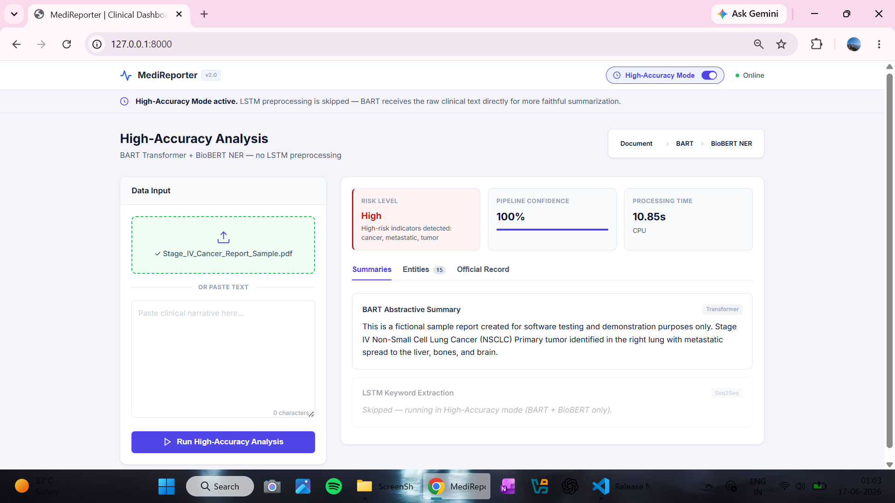

# 🏥 MediReporter: AI-Powered Clinical Report Analysis System

## 📌 Overview

MediReporter is an AI-powered healthcare Natural Language Processing (NLP) platform designed to automatically analyze clinical reports, generate concise medical summaries, extract critical biomedical entities, and assess patient risk levels.

The system combines Deep Learning, Transformer Models, and Biomedical NLP to help healthcare professionals quickly identify important medical information from lengthy clinical narratives.

By leveraging LSTM Attention Networks, BART Transformer Summarization, and BioBERT Named Entity Recognition (NER), MediReporter transforms unstructured medical reports into actionable clinical insights through an interactive web dashboard.

---

## 📷 Application Preview



---

## 🚀 Key Features

### 📄 Clinical Report Upload

* Upload PDF medical reports
* Upload TXT documents
* Manual text input support
* Drag-and-drop interface

### 📝 Automated Medical Summarization

* Generates concise clinical summaries
* Reduces report review time
* Preserves critical medical context

### 🧬 Biomedical Entity Extraction

Automatically identifies:

#### Diseases

* Diabetes
* Hypertension
* Lung Cancer
* Pneumonia
* COPD

#### Symptoms

* Chest Pain
* Fever
* Fatigue
* Cough
* Shortness of Breath

#### Medications

* Metformin
* Aspirin
* Insulin
* Morphine

#### Treatments

* Chemotherapy
* Surgery
* Radiation Therapy
* Immunotherapy

### ⚠️ Patient Risk Assessment

Classifies patients into:

* Low Risk
* Moderate Risk
* High Risk

Based on:

* Disease severity
* Medical keywords
* Extracted entities
* Clinical findings

### 📊 Interactive Dashboard

* Summary Visualization
* Entity Analysis
* Risk Assessment Panel
* Real-Time Results

---

# 🎯 Problem Statement

Clinical reports are often lengthy and difficult to review quickly. Healthcare professionals spend significant time identifying important diseases, symptoms, medications, and treatment information.

Manual analysis can:

* Increase review time
* Delay decision-making
* Lead to overlooked information
* Reduce operational efficiency

MediReporter addresses these challenges by automating clinical report understanding using advanced AI and NLP techniques.

---

# 🎯 Objectives

The primary objectives of this project are:

* Automatically analyze clinical reports
* Generate human-readable summaries
* Extract critical biomedical entities
* Identify major health conditions
* Predict patient risk levels
* Deliver results through an intuitive web interface

---

# 🏗 System Architecture

```text
Clinical Report
       │
       ▼
LSTM Attention Model
       │
       ▼
Important Sentence Extraction
       │
       ▼
BART Summarization
       │
       ▼
Clinical Summary
       │
       ▼
BioBERT NER
       │
       ▼
Entity Extraction
       │
       ▼
Risk Classification
       │
       ▼
JSON Response
       │
       ▼
Interactive Dashboard
```

---

# 🤖 AI Models Used

## 1️⃣ LSTM Seq2Seq with Bahdanau Attention

### Purpose

Acts as the first stage of the NLP pipeline.

### Responsibilities

* Clinical sentence scoring
* Important sentence extraction
* Keyword identification
* Context filtering

### Benefits

Medical reports often contain redundant information. This model identifies clinically relevant content before summarization.

---

## 2️⃣ BART Large CNN

### Model

```python
facebook/bart-large-cnn
```

### Type

Transformer-based Abstractive Summarization Model

### Responsibilities

* Clinical report summarization
* Context preservation
* Human-readable output generation

### Example

Input:

```text
2-page clinical report
```

Output:

```text
5-line concise medical summary
```

---

## 3️⃣ BioBERT Named Entity Recognition

### Model

```python
d4data/biomedical-ner-all
```

### Responsibilities

* Disease Detection
* Symptom Recognition
* Drug Identification
* Treatment Extraction

### Benefits

Provides structured clinical information from unstructured reports.

---

# 💻 Technology Stack

## Frontend

### HTML5

* User Interface Structure

### CSS3

* Responsive Design
* Dashboard Styling

### JavaScript

* Dynamic UI Updates
* API Integration
* Result Rendering
* File Upload Management

---

## Backend

### FastAPI

* REST API Development
* Model Serving
* Request Handling
* Response Generation

### Uvicorn

* ASGI Server
* High Performance Deployment

---

## Artificial Intelligence

### PyTorch

* Deep Learning Models
* LSTM Implementation
* Model Inference

### Hugging Face Transformers

* BART Integration
* BioBERT Integration
* NLP Pipeline Execution

---

# 📂 Project Structure

```text
MediReporter/
│
├── backend/
│   ├── app.py
│   ├── routes/
│   ├── models/
│   ├── services/
│   └── utils/
│
├── frontend/
│   ├── index.html
│   ├── styles.css
│   └── script.js
│
├── models/
│   ├── lstm_attention/
│   ├── bart/
│   └── biobert/
│
├── datasets/
│
├── reports/
│
├── screenshots/
│
├── requirements.txt
│
└── README.md
```

---

# 🔌 API Endpoints

## Health Check

```http
GET /api/health
```

Checks server and model status.

---

## Version Information

```http
GET /api/version
```

Returns:

* Application Version
* Framework Information
* Model Versions

---

## Report Analysis

```http
POST /api/analyze
```

### Request

```json
{
  "text": "Clinical Report Content"
}
```

### Response

```json
{
  "summary": "...",
  "entities": {
    "diseases": [],
    "symptoms": [],
    "drugs": [],
    "treatments": []
  },
  "risk": {
    "level": "High",
    "score": 0.91
  }
}
```

---

# ⚙️ Installation

## Clone Repository

```bash
git clone https://github.com/yourusername/MediReporter.git
cd MediReporter
```

## Create Virtual Environment

```bash
python -m venv venv
```

### Windows

```bash
venv\Scripts\activate
```

### Linux / Mac

```bash
source venv/bin/activate
```

## Install Dependencies

```bash
pip install -r requirements.txt
```

## Run Application

```bash
uvicorn app:app --reload
```

---

# 📈 Future Enhancements

* Multi-Language Clinical Reports
* Voice-Based Medical Report Analysis
* Medical Chatbot Integration
* Electronic Health Record (EHR) Support
* Disease Prediction Models
* Cloud Deployment
* Hospital Analytics Dashboard
* Real-Time Clinical Monitoring

---

# 🎓 Learning Outcomes

Through this project, I gained hands-on experience in:

* Healthcare AI
* Natural Language Processing (NLP)
* Deep Learning
* Transformer Models
* Biomedical NLP
* FastAPI Development
* REST API Design
* Model Deployment
* Full-Stack Integration

---

# 👨‍💻 Author

**Aditya Kumar Singh**

B.Tech (Hons.) – Computer Science & Engineering
(Data Science and Data Engineering)

📧 [Email](mailto:adityasingh81201@gmail.com)  
🔗 [LinkedIn](https://www.linkedin.com/in/aditya-kumar-singh-990377291/)  
💻 [Portfolio](https://adityasingh81201.wixsite.com/professional-portfol)

---

## ⭐ If you found this project useful, consider giving it a star!
